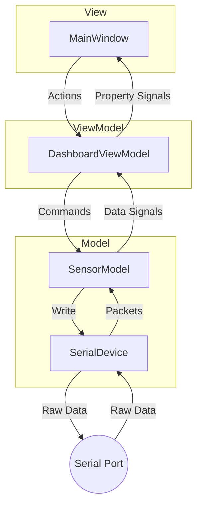

# MVVM Refactoring for Serial Data Processing

This plan outlines the refactoring of the current serial communication logic in `MainWindow` into an MVVM (Model-View-ViewModel) pattern. This approach improves maintainability and makes it easier to support additional devices in the future.

## User Review Required

> [!IMPORTANT]
> The refactoring will change how `MainWindow` interacts with the serial port. Instead of calling `serial->write()` directly, it will call methods on a `ViewModel`.

## Proposed Changes

### 1. Data Models & Protocols
Move protocol-specific definitions to a separate header to be shared across the Model and ViewModel.

#### [NEW] [serial_protocol.h](file:///home/andrew/qt_project/qt-dashboard/serial_protocol.h)
- Define `SensorID`, `DataType`, and packet structures.

### 2. Model Layer
Handle raw serial I/O and packet parsing.

#### [NEW] [serial_device.h/cpp](file:///home/andrew/qt_project/qt-dashboard/serial_device.h)
- `SerialDevice` class: Wraps `QSerialPort`.
- Handles `readyRead`, buffer management, and basic packet extraction.
- Emits signals when a complete packet is received.

#### [NEW] [sensor_model.h/cpp](file:///home/andrew/qt_project/qt-dashboard/sensor_model.h)
- `SensorModel` class: Inherits from `SerialDevice` or uses it.
- Implements `parseProtocol` (currently in `MainWindow`).
- Emits specific signals like `temperatureChanged(double)`, `ledStatusChanged(bool)`.

### 3. ViewModel Layer
Bridge the Model and the View.

#### [NEW] [dashboard_viewmodel.h/cpp](file:///home/andrew/qt_project/qt-dashboard/dashboard_viewmodel.h)
- `DashboardViewModel` class:
    - Holds an instance of `SensorModel`.
    - Exposes properties (e.g., `temperature`, `isConnected`) as `Q_PROPERTY` or via signals.
    - Provides slots/methods for UI actions (e.g., `toggleLed()`, `connectDevice()`).
    - Handles formatting (e.g., adding " °C" to temperature).

### 4. View Layer (MainWindow)
Refactor `MainWindow` to be a "thin" View.

#### [MODIFY] [mainwindow.h/cpp](file:///home/andrew/qt_project/qt-dashboard/mainwindow.h)
- Remove `QSerialPort`, `m_serialBuffer`, and `parseProtocol`.
- Add an instance of `DashboardViewModel`.
- Bind UI elements to ViewModel signals/properties.

---

## Architecture Diagram (Mermaid)

## Verification Plan

### Automated Tests
- Unit tests for `SensorModel` parsing logic (mocking serial data).
- Unit tests for `DashboardViewModel` property updates.

### Manual Verification
- Verify that connecting to the serial port still works.
- Verify that temperature and LED status updates are reflected in the UI.
- Verify that "Monitor On/Off" and "LED Toggle" commands work.
